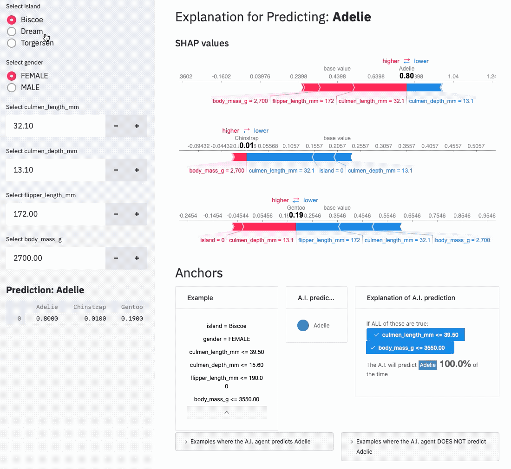

# Streamlit Talk for Data Umbrella 2020

Simple dashboard using SHAP values and Anchors for explanations for predictions:



## Usage

0. Install [anaconda](https://www.anaconda.com/products/individual).
1. Create a virtual environment:

```bash
conda create -n data-umbrealla-streamlit python=3.8
```

2. Install requirements:

```bash
conda activate data-umbrealla-streamlit
pip install -r requirements-all.txt
```

3. Run the intro:

```bash
streamlit run intro.py --server.runOnSave True
```

4. Run the explanation:

```py
streamlit run explain.py --server.runOnSave True
```

## License

This repo is under the [MIT License](LICENSE).
